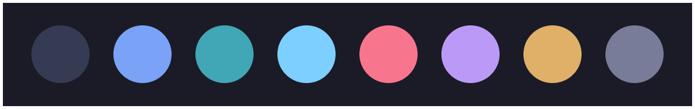

<div align="center">
  
  <h1>hyper-tokyo-night</h1>
</div>

> Clean, dark [Hyper](https://hyper.is/) theme based on the [Tokyo Night VS Code theme](https://github.com/enkia/tokyo-night-vscode-theme)




## Install

```
$ hyper install hyper-tokyo-night
```

Alternatively, open `~/.hyper.js` and add `"hyper-tokyo-night"` to the `plugins` array.

## Credits

- [Tokyo Night](https://github.com/enkia/tokyo-night-vscode-theme) (d'oh)
- [hyper-snazzy](https://github.com/sindresorhus/hyper-snazzy) (tab styling)
